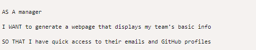
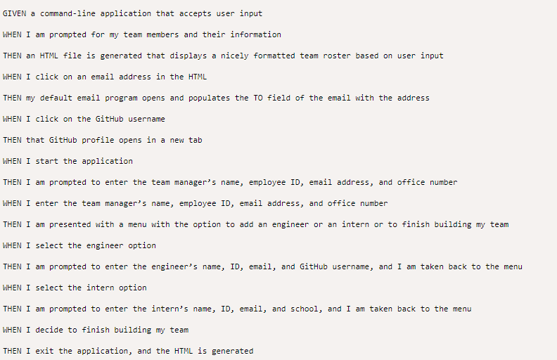
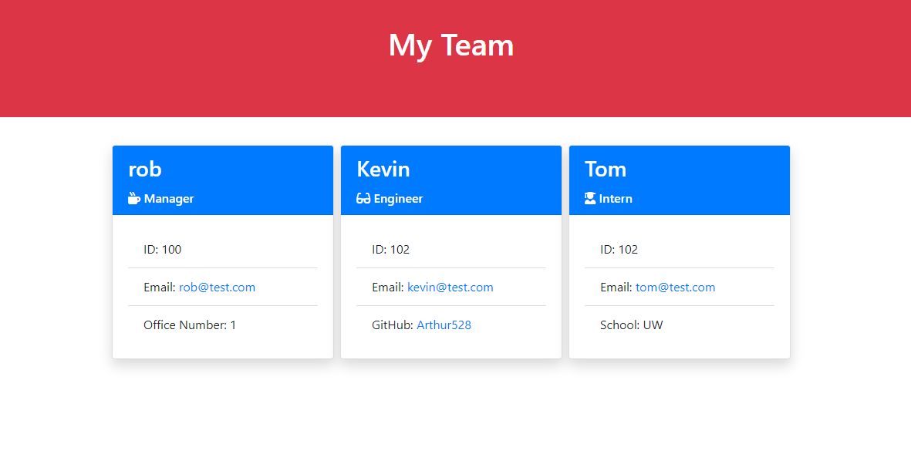

# Object-Oriented Programming Challenge: Team Profile Generator

## Technologies

## Description

Your challenge is to build a Node.js command-line application that takes in information about employees on a software engineering team and generates an HTML webpage that displays summaries for each person.

## Acceptance Criteria

## HTML Image

## Installation

Please pull down the repository and run it locally using node.js
You will need to install dependency packages including npm, inquirer, and Jest

## Links
A link to the [code](https://github.com/Arthur528/moonraker-team-profile-generator)

https://github.com/Arthur528/moonraker-team-profile-generator

A link to the [demo video](https://drive.google.com/file/d/1Ecu8lGylQGX8rr-Gp9FasOVoK5Bwcwv2/view)

https://drive.google.com/file/d/1Ecu8lGylQGX8rr-Gp9FasOVoK5Bwcwv2/view

## License

Please refer to the LICENSE in the repo.
